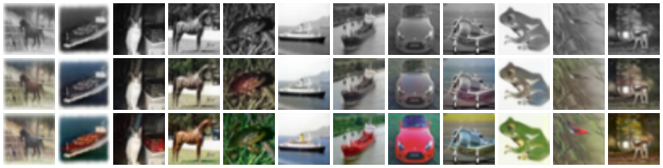

# colourise-net

Turn greyscale images into colourised image

This is a small PyTorch U-Net model, trained on CIFAR-10

*Top: greyscale input. Middle: model output. Bottom: real image. (Images are 32×32, upscaled for display.)*

## How it works

The model tries to learn a function `f(greyscale_image) -> colour_image`.

Each CIFAR-10 photo is converted to greyscale as the input, and the original colour version is the target.

- **Data:** CIFAR-10 (60,000 colour photos, 32×32). Split into 40,000 train / 10,000 validation / 10,000 test.
- **Model:** A U-Net (~1.9M parameters). The encoder shrinks the image to understand what's in it, the decoder grows it back to paint in colours, and skip connections carry sharp details across.
- **Loss:** Mean squared error between predicted and real pixel values.
- **Training:** 15 epochs with the Adam optimizer (learning rate 0.001), saving the model with the best validation loss.
